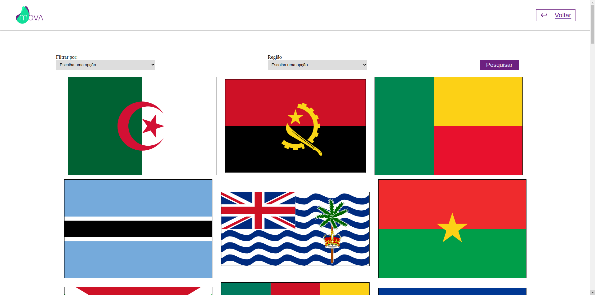
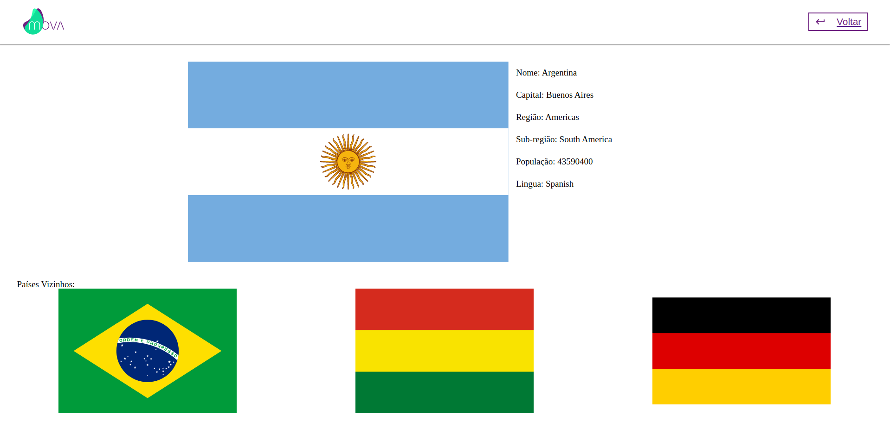

<h1 align="center"></h1>
 
A <strong>Mova</strong> me trouxe um desafio para fazer parte do time deles, construir um sistema de busca consumindo uma API de paises, o mais proveitoso desse desafio foi tratar multiplas opções de requisição e gerenciar estados com o REDUX.
  

<a href="https://mova-gabriellcastro.vercel.app">Deploy Aqui!</a>

### 🛠 Tecnologias

As seguintes ferramentas foram usadas na construção do projeto:

- [x] REACT
- [x] REDUX
- [x] API
- [x] FIGMA
- [x] HTML5
- [x] CSS3

### 💻 Desenvolvedor:

Desenvolvido por Gabriel Castro ! 🥇  
    
